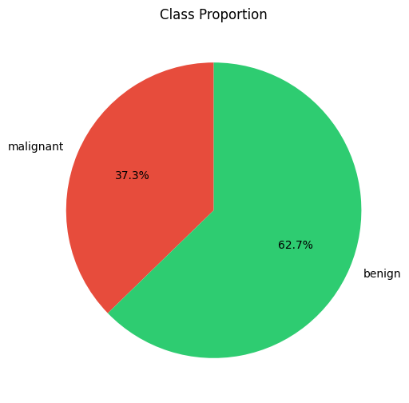
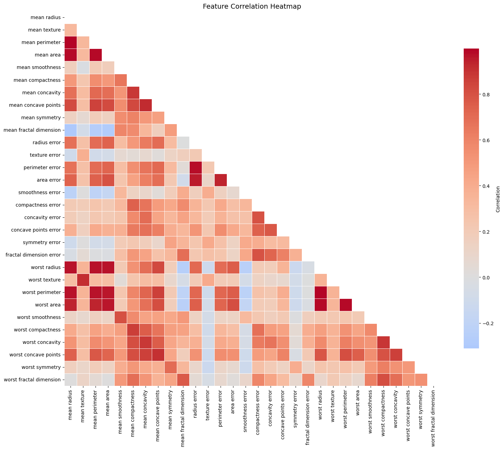
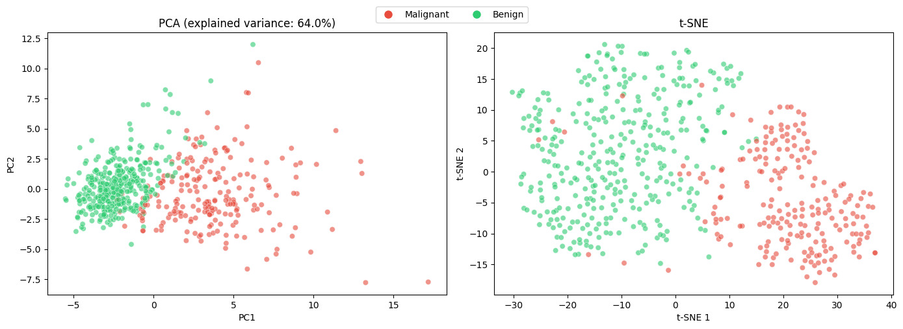
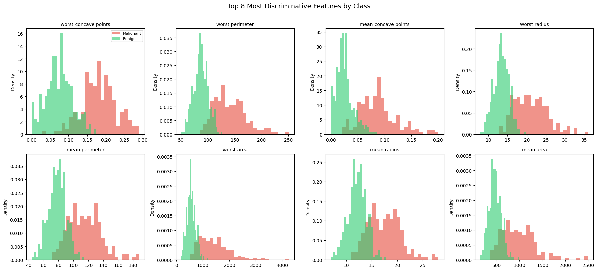
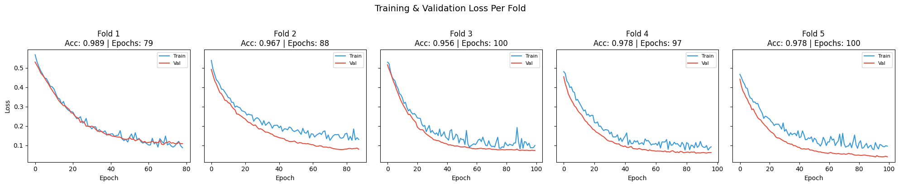
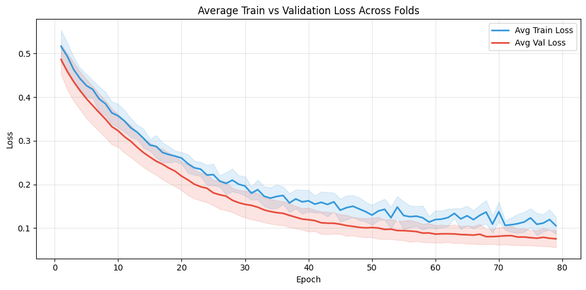
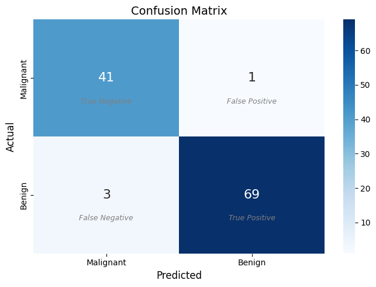
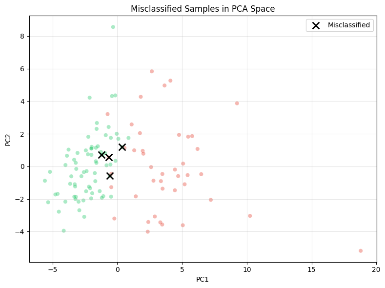

# Breast Cancer Detection with PyTorch

This project implements a neural-network pipeline for binary breast cancer diagnosis (malignant vs benign) using the **Wisconsin Diagnostic Breast Cancer** dataset from `scikit-learn`.  
The workflow includes exploratory analysis, dimensionality reduction, robust model training with cross-validation, and detailed post-hoc performance evaluation.

## Project Overview

The core objective is to classify breast tumor samples as:

- `0` -> malignant
- `1` -> benign

The full pipeline is developed in `src/nn.ipynb`, and the final trained artifacts and metrics are exported to `src/outputs/`.

## Dataset

The project uses `sklearn.datasets.load_breast_cancer()`:

- **Samples:** 569
- **Input features:** 30 numeric, real-valued diagnostic features
- **Classes:** 2 (malignant, benign)
- **Class distribution:**
  - Malignant: 212 (~37.3%)
  - Benign: 357 (~62.7%)

### Data Preparation Pipeline

1. **Stratified train/test split** (`80/20`, `random_state=42`) to preserve class proportions.
2. **Standardization** with `StandardScaler` (fit on train only).
3. **PCA preprocessing** with `n_components=0.95`, retaining enough components to preserve 95% explained variance and reduce redundancy.

This preprocessing strategy improves numerical stability and helps the model focus on the most informative directions of variation.

### EDA Visuals

#### 1) Class Proportion



This chart shows a moderate class imbalance (benign samples are more frequent than malignant).  
This motivated the use of stratified splits and class-aware loss weighting during cross-validation.

#### 2) Feature Correlation Heatmap



The heatmap highlights strong correlations among radius, perimeter, and area-related features.  
This redundancy supports dimensionality reduction with PCA before feeding data into the neural network.

#### 3) PCA and t-SNE Projection



Both views show class structure and partial separation, with overlap in harder regions.  
These overlap zones are consistent with where misclassifications tend to occur.

#### 4) Most Discriminative Feature Distributions



This panel compares the top discriminative features by class and reveals clear distribution shifts between malignant and benign groups.  
The separation confirms that the dataset contains strong predictive signal even with a compact model.

## Model Architecture

### Network Design

The model (`BCNet`) is a compact 3-layer fully connected network implemented in PyTorch:

- `Linear(input_dim -> 16)` + `BatchNorm1d(16)` + `LeakyReLU` + `Dropout(0.3)`
- `Linear(16 -> 8)` + `BatchNorm1d(8)` + `LeakyReLU` + `Dropout(0.3)`
- `Linear(8 -> 1)` output logit

The architecture was intentionally kept small. In experiments, wider variants (for example `30 -> 64 -> 32 -> 16 -> 1`) did not improve performance and tended to generalize worse on this small tabular dataset, reinforcing that more parameters do not necessarily produce better results.

### Technical Features

| Feature | Implementation | Rationale |
|---|---|---|
| `BCEWithLogitsLoss` | Replaces separate `sigmoid` + BCE in one loss | More numerically stable (log-sum-exp formulation) and safer than explicit sigmoid-probability BCE pipelines |
| Batch normalization | `BatchNorm1d` after each hidden linear layer | Reduces internal covariate shift, stabilizes gradients, and improves optimization behavior |
| Dropout (0.3) | `Dropout(0.3)` after hidden activations | Regularization against overfitting; automatically disabled at inference with `model.eval()` |
| LeakyReLU | `F.leaky_relu(...)` in hidden blocks | Avoids dead neurons by preserving small negative-side gradients |
| Weight decay | `Adam(..., weight_decay=1e-4)` during CV | L2-style regularization complementary to dropout |
| Class weighting | `BCEWithLogitsLoss(pos_weight=...)` in CV | Compensates class imbalance and increases penalty for malignant misses |
| LR scheduling | `ReduceLROnPlateau(factor=0.5, patience=5)` | Adaptively lowers learning rate when validation loss plateaus |
| Early stopping | Patience `= 10` on validation loss | Limits overfitting and restores best fold weights |
| Reproducibility | `torch.manual_seed(42)`, `torch.cuda.manual_seed(42)`, `np.random.seed(42)` | Improves run-to-run determinism and experiment comparability |

### Training Configuration

- **Loss:** `BCEWithLogitsLoss`
  - During cross-validation, `pos_weight` is used to account for class imbalance.
- **Optimizer:** `Adam` (`lr=0.001`, weight decay in CV stage)
- **Scheduler:** `ReduceLROnPlateau` (monitoring validation loss)
- **Batch size:** 32
- **Cross-validation:** `StratifiedKFold(n_splits=5, shuffle=True, random_state=42)`
- **Early stopping:** patience-based stopping on validation loss

After CV, a final model is trained on the full training set and evaluated on the held-out test set.

### Training Dynamics

#### Per-Fold Loss Curves



All five folds exhibit consistent convergence behavior, with early stopping triggering between epochs 79 and 97. Validation loss tracks closely with training loss throughout — and in some cases sits below it. This is expected when using dropout, which is active during training (making the task harder) but disabled during evaluation.

#### Averaged Train vs Validation Loss



The averaged curve with ±1 standard deviation bands confirms low variance across folds and no signs of overfitting. The narrow confidence bands indicate that model performance is stable regardless of the particular data split.

## Performance Analysis

The following metrics are loaded from `src/outputs/metrics.json`.

| Metric               |  Value |
| -------------------- | -----: |
| Test Accuracy        | 0.9649 |
| Test Loss            | 0.1050 |
| ROC AUC              | 0.9954 |
| Average Precision    | 0.9934 |
| 5-Fold Mean Accuracy | 0.9736 |
| 5-Fold Accuracy Std  | 0.0112 |

## Clinical Interpretation

In cancer screening, the costs of different error types are highly asymmetric. A **false negative** (malignant tumor classified as benign) can delay treatment with potentially life-threatening consequences, while a **false positive** (benign tumor flagged as malignant) leads to additional screening — inconvenient but not dangerous. The model's error profile shows 3 false positives (benign predicted as malignant) and 1 false negative (malignant predicted as benign).  

### Interpretation

- **Discrimination quality is very strong** (AUC ~0.995), indicating excellent ranking between malignant and benign cases.
- **Precision-recall behavior is also strong** (AP ~0.993), important for imbalanced medical classification settings.
- **Generalization appears stable** with high CV mean accuracy and low fold-to-fold variance.
- **Decision boundary** uses the default threshold of `0.5` on predicted probabilities.

### Misclassification Analysis



Out of 114 test samples, the model misclassifies 4: 3 false positives (benign predicted as malignant) and 1 false negative (malignant predicted as benign).

| Sample | Actual | Predicted | P(benign) | Confidence |
|---|---|---|---|---|
| 16 | Benign | Malignant | 0.251 | 74.9% |
| 38 | Benign | Malignant | 0.200 | 80.0% |
| 53 | Malignant | Benign | 0.874 | 87.4% |
| 66 | Benign | Malignant | 0.350 | 65.0% |



When projected into PCA space, all misclassified samples fall in the overlap region between the two class clusters. These are genuinely ambiguous cases — tumors whose feature profiles sit at the boundary between malignant and benign — rather than systematic model failures.

Notably, the false-negative case (Sample 53) was classified with high confidence (87.4%), meaning this malignant tumor has a feature profile that closely resembles benign tissue — the clinically most concerning type of error.

## Artifacts

Saved under `src/outputs/`:

- `best_model.pth` - trained PyTorch model weights
- `scaler.pkl` - fitted standardization object
- `metrics.json` - exported evaluation metrics


## Setup and Usage

### 1) (Recommended) Create and activate a virtual environment

```bash
python3 -m venv .venv
source .venv/bin/activate
```

### 2) Install dependencies

```bash
pip install -r requirements.txt
```

### 3) Run the notebook

```bash
jupyter lab
```

Open `src/nn.ipynb` and execute all cells to reproduce training, evaluation, and output artifacts.